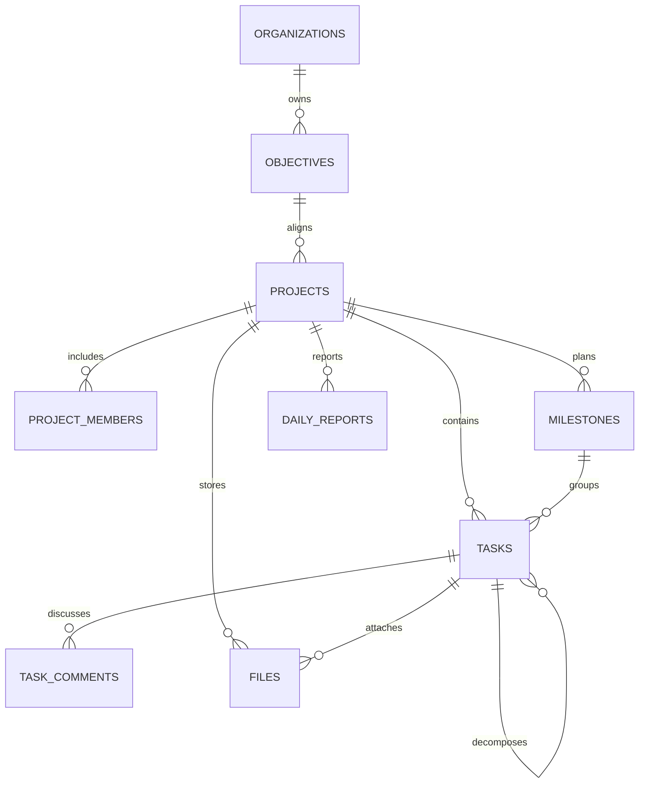

# 项目协同中心数据设计

## 范围

本阶段只交付项目协同中心的数据基础，不新增 `src/app` 路由或页面组件。交付物包括 Supabase migration、TypeScript 领域类型、可供后续页面直接消费的 Mock 数据，以及 `/projects` 与 `/projects/[id]` 的页面规划。

现有 `files` 表继续作为统一文件元数据表，本阶段只增加项目与任务关联字段，避免形成两套文件模型。

## 领域关系

所有业务表都保留 `organization_id`。项目下属表同时保存 `project_id`，并使用组合外键校验组织与项目一致，防止跨企业或跨项目错误关联。内部关联使用 bigint 主键，对外路由和前端数据使用 UUID `public_id`。

## 表设计

### objectives 企业目标

- 核心字段：标题、描述、目标层级、负责人、周期、进度、状态。
- 支持 `parent_objective_id` 形成目标拆解树。
- 状态：`draft`、`active`、`completed`、`cancelled`。
- 目标层级：`company`、`department`、`team`。

### projects 项目

- 可选关联一个企业目标。
- 核心字段：项目编码、名称、描述、负责人、优先级、健康度、进度、计划日期、实际结束时间、状态。
- 状态：`planning`、`active`、`on_hold`、`completed`、`cancelled`。
- 健康度：`on_track`、`at_risk`、`off_track`。
- 同一企业内项目编码唯一；软删除后编码可复用。

### project_members 项目成员

- 关联现有 `organization_members`，不直接重复保存用户资料。
- 角色：`owner`、`manager`、`member`、`viewer`。
- 记录投入比例、加入时间和离开时间。
- 每位企业成员在同一项目中只有一条成员记录。

### milestones 项目里程碑

- 核心字段：名称、描述、负责人、开始/截止日期、完成时间、进度、排序、状态。
- 状态：`pending`、`in_progress`、`completed`、`overdue`。

### tasks 任务

- 可选归属里程碑，也可用 `parent_task_id` 拆分子任务。
- 核心字段：标题、描述、执行人、报告人、状态、优先级、进度、工时、日期与排序。
- 状态：`backlog`、`todo`、`in_progress`、`in_review`、`done`、`cancelled`。
- 优先级：`low`、`medium`、`high`、`urgent`。

### task_comments 任务评论

- 保存评论正文、作者以及创建/编辑/软删除时间。
- 本阶段不加入评论线程和表情反应，后续可独立扩展，不影响现有结构。

### files 项目文件

- 复用现有统一文件表，新增 `project_id` 与可选 `task_id`。
- 文件关联任务时必须同时关联任务所属项目。
- 保留现有 `entity_type`、`entity_public_id`，兼容未来审批、员工档案等模块。

### daily_reports 项目日报

- 每位成员每天在同一项目最多一份日报。
- 内容拆分为今日总结、下一步计划、阻塞问题、所需支持。
- 状态：`draft`、`submitted`，并记录提交时间。

## 权限模型

| 能力 | 老板 | 管理员 | 项目负责人/项目管理员 | 项目成员 | 查看者 |
| --- | --- | --- | --- | --- | --- |
| 查看企业内项目 | 全部 | 全部 | 所属项目 | 所属项目 | 所属项目 |
| 创建项目 | 否 | 是 | 否 | 否 | 否 |
| 编辑项目与成员 | 只读 | 是 | 是 | 否 | 否 |
| 管理里程碑与任务 | 只读 | 是 | 是 | 否 | 否 |
| 执行分配给自己的任务 | 只读 | 是 | 是 | 是 | 否 |
| 评论、提交日报、上传项目文件 | 只读 | 是 | 是 | 是 | 否 |

“老板”沿用系统角色代码 `owner`，拥有企业级只读视角；“管理员”沿用 `admin`，是唯一可创建项目的企业角色。项目负责人由 `projects.owner_member_id` 表示，项目管理员由 `project_members.role = manager` 表示。成员执行权限限定为更新自己任务的状态、进度和完成时间，不能改标题、执行人、日期等管理字段。

## 数据访问与完整性

- 所有项目数据启用 RLS；匿名角色没有业务表权限。
- 企业成员仅能看到自己所属项目，老板和管理员可查看企业全部项目。
- 创建项目要求当前用户是该企业管理员，并且创建人必须等于当前企业成员身份。
- 项目的组织归属、公开 ID、创建人和创建时间一经写入不可修改，阻止项目被跨企业迁移。
- 项目负责人/管理员可管理项目、成员、里程碑和任务。
- 任务执行人必须已有项目成员记录；普通成员只能更新分配给自己的任务执行字段，数据库触发器阻止越权修改管理字段。
- 评论、日报和文件写入要求作者/上传人是当前用户本人，并且当前用户属于该项目。
- 所有外键列建立索引；常用列表使用项目状态、负责人、截止日期、任务执行人和日报日期组合索引。

## TypeScript 与 Mock 契约

- TypeScript 使用 camelCase，状态字段由只读常量推导联合类型，避免数据库状态与页面状态漂移。
- `ProjectListItem` 直接满足项目列表所需的名称、负责人、成员、进度、状态和截止日期。
- `ProjectDetailData` 聚合目标、项目、成员、里程碑、任务、评论、文件和日报，供详情页各 Tab 复用。
- Mock 数据使用稳定 UUID，并通过选择器生成列表与详情聚合结果；测试校验项目负责人属于项目、子资源引用有效以及未知项目返回 `undefined`。

## 本阶段明确不做

- 不创建 `/projects` 或 `/projects/[id]` 页面文件。
- 不开发项目表单、看板、甘特图库、上传流程或 Supabase 查询层。
- 不改变 Dashboard，也不开发其他业务模块。
